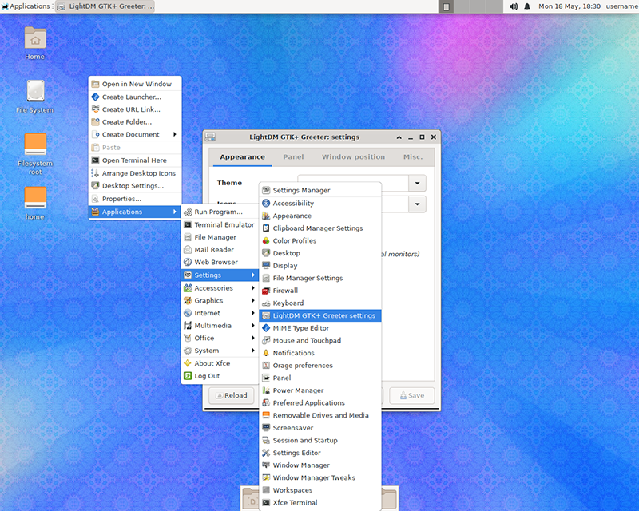
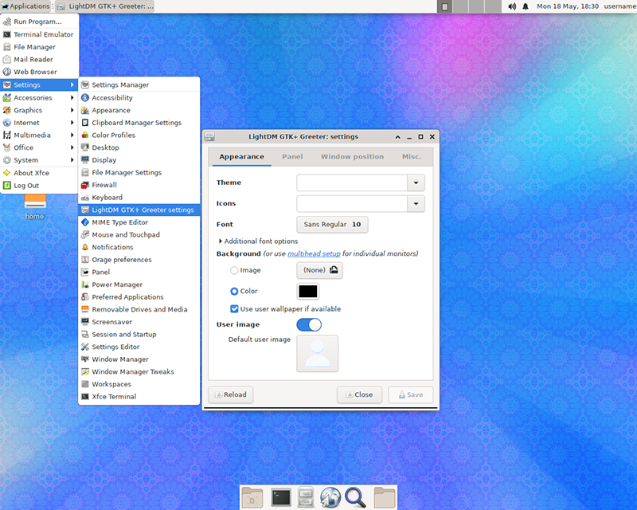
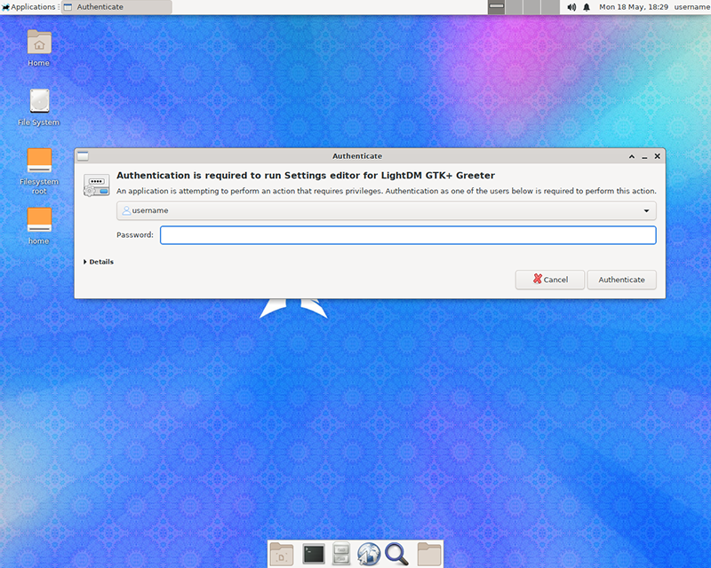
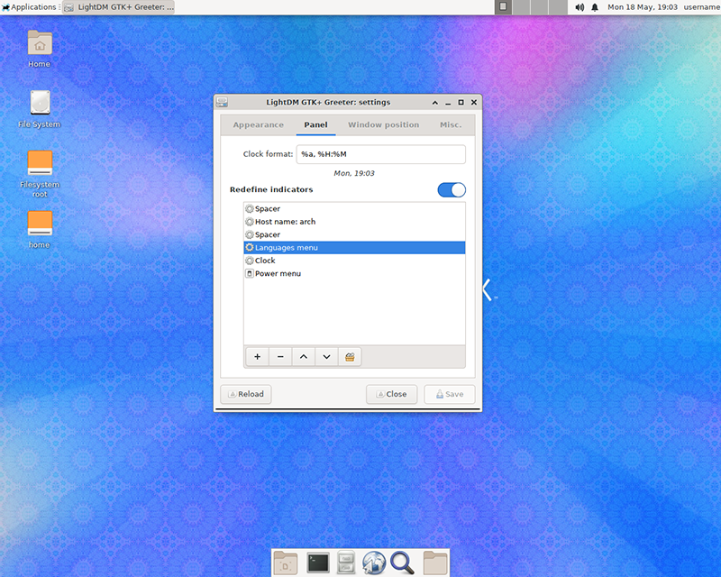
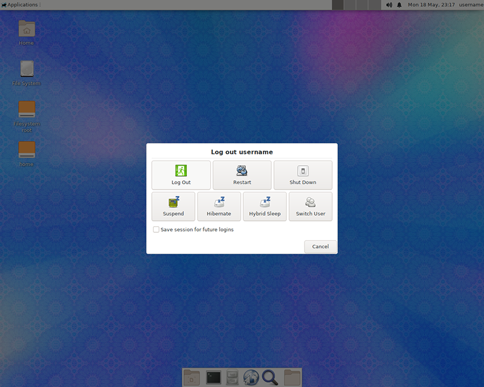
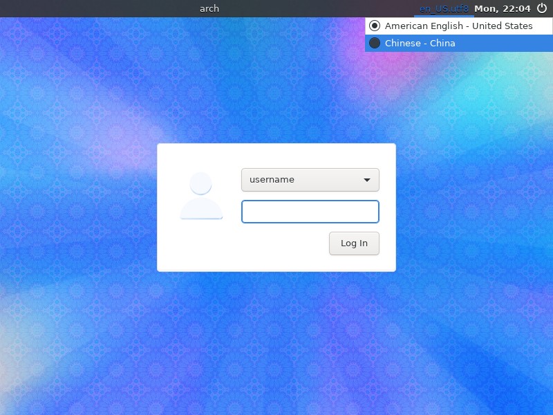
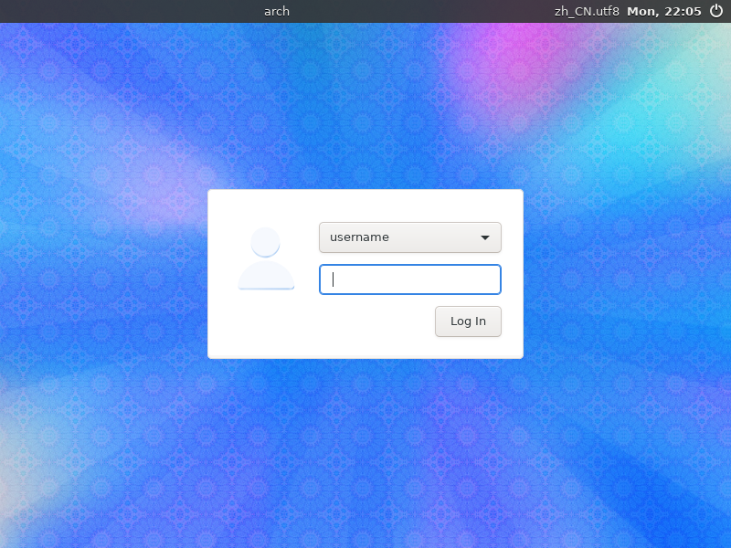
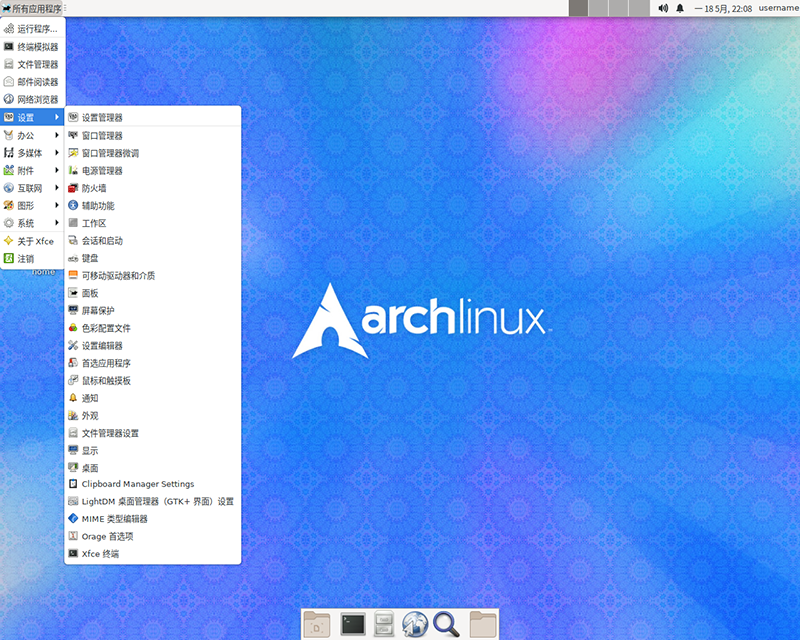

# Arch Linux 系统中文化 

刚安装好的 `Arch Linux` 系统是英文界面也不能显示和输入中文，需要进行系统界面中文化设置、安装中文字体和中文输入法。

## 系统界面中文化设置

### 在更改为中文界面前需要先安装中文字体

`Arch Linux` 官方库中的中文字体

- `CJK` 字体

  - `adobe-source-han-sans-otc-fonts` - 思源黑体，无衬线字体。
  - `adobe-source-han-serif-otc-fonts` - 思源宋体，衬线字体。
  - `noto-fonts-cjk` - Google Noto CJK 字体， 提供简体中文、繁体中文、日文、韩文一致的设计和外观。
  - `wqy-microhei` - 文泉驿微米黑，无衬线形式字体。
  - `wqy-microhei-lite` - 文泉驿微米黑 light 版（笔画更细）。

> 提示： 在安装思源 CJK 全集或者 Noto-CJK 全集后，部分文字显示为日文异形字体，可参看 [修正简体中文显示为异体（日文）字形](arch-linux-chinese-localization.md#修正简体中文显示为异体日文字形) 进行解决。

- `Adobe` 思源字体

  - `adobe-source-han-sans-cn-fonts` - 思源黑体简体中文部分
  - `adobe-source-han-sans-hk-fonts` - 思源黑体繁体中文部分
  - `adobe-source-han-sans-tw-fonts` - 思源黑体繁体中文部分
  - `adobe-source-han-serif-cn-fonts` - 思源宋体简体中文部分
  - `adobe-source-han-serif-tw-fonts` - 思源宋体繁体中文部分

- 文泉驿字体

  - `wqy-zenhei` - 文泉驿正黑体，黑体 (无衬线) 的中文轮廓字体，附带文泉驿点阵宋体 (也支持部分日韩字符)。
  - `wqy-bitmapfont` - 文泉驿点阵宋体 (衬线) 中文字体。

- 文鼎字体

  - `ttf-arphic-ukai` - 楷书 (带有笔触) Unicode 字体 (推荐启用反锯齿)
  - `ttf-arphic-uming` - 明体 (印刷) Unicode 字体
  
- `opendesktop-fonts` - 新宋字体

> 除了官方库中的字体还可以自己安装别的字体，详情请看官方 [wiki](https://wiki.archlinux.org/index.php/Fonts_(%E7%AE%80%E4%BD%93%E4%B8%AD%E6%96%87)#%E4%B8%AD%E6%97%A5%E9%9F%A9%E8%B6%8A%E6%96%87%E5%AD%97) 说明。

### 安装中文字体

中文字体的选择很多，可以选择自己喜欢的字体或全部安装，这里只安装 `noto-fonts-cjk` 和 `adobe-source-han-sans-otc-fonts` 两种字体

```bash
[username@arch ~]$ sudo pacman -S noto-fonts-cjk adobe-source-han-sans-otc-fonts
```

> 字体安装好后中文就能正常显示了

### 修正简体中文显示为异体（日文）字形

安装了 `Noto Sans CJK` 或 `adobe source han sans otc fonts`（思源黑体） 或 `adobe source han serif otc fonts`（思源宋体）后，在某些情况下（框架未定义地区）汉字字形与标准形态不符，例如门、关、复等字字形与规范中文不符。

解决的方法有几种，这里选择使用手动调整字体优先级的方法来解决。更详细信息可查看官方 [wiki](https://wiki.archlinux.org/index.php/Localization_(%E7%AE%80%E4%BD%93%E4%B8%AD%E6%96%87)/Simplified_Chinese_(%E7%AE%80%E4%BD%93%E4%B8%AD%E6%96%87)#%E4%BF%AE%E6%AD%A3%E7%AE%80%E4%BD%93%E4%B8%AD%E6%96%87%E6%98%BE%E7%A4%BA%E4%B8%BA%E5%BC%82%E4%BD%93%EF%BC%88%E6%97%A5%E6%96%87%EF%BC%89%E5%AD%97%E5%BD%A2)

在 `/etc/fonts/conf.avail/` 或 `/etc/fonts/conf.d/` 目录下创建文件如 `64-language-selector-prefer.conf`，修改系统选择字体的优先级

*如安装的是 `noto-fonts-cjk` 字体*

```bash
[username@arch ~]$ cd /etc/fonts/conf.avail/
[username@arch ~]$ sudo nano 64-language-selector-prefer.conf
```

*在 `64-language-selector-prefer.conf` 中写入*

```nano
<?xml version="1.0"?>
<!DOCTYPE fontconfig SYSTEM "fonts.dtd">
<fontconfig>
  <alias>
    <family>sans-serif</family>
    <prefer>
      <family>Noto Sans CJK SC</family>
      <family>Noto Sans CJK TC</family>
      <family>Noto Sans CJK JP</family>
    </prefer>
  </alias>
  <alias>
    <family>monospace</family>
    <prefer>
      <family>Noto Sans Mono CJK SC</family>
      <family>Noto Sans Mono CJK TC</family>
      <family>Noto Sans Mono CJK JP</family>
    </prefer>
  </alias>
</fontconfig>
```

*如安装的是 `adobe-source-han-sans-otc-fonts` 字体*

```bash
[username@arch ~]$ cd /etc/fonts/conf.avail/
[username@arch ~]$ sudo nano 64-language-selector-prefer.conf
```

*在 `64-language-selector-prefer.conf` 中写入*

```nano
<?xml version="1.0"?>
<!DOCTYPE fontconfig SYSTEM "fonts.dtd">
<fontconfig>
  <alias>
    <family>sans-serif</family>
    <prefer>
      <family>Source Han Sans SC</family>
      <family>Source Han Sans TC</family>
      <family>Source Han Sans HW</family>
      <family>Source Han Sans K</family>
    </prefer>
  </alias>
  <alias>
    <family>monospace</family>
    <prefer>
      <family>Source Han Sans SC</family>
      <family>Source Han Sans TC</family>
      <family>Source Han Sans HW</family>
      <family>Source Han Sans K</family>
    </prefer>
  </alias>
</fontconfig>
```

如果是在 `/etc/fonts/conf.avail` 目录下创建的 `xml` 文件，则需要将该 `xml` 文件软链接到 `/etc/fonts/conf.d` 下

```bash
[username@arch ~]$ sudo ln -s /etc/fonts/conf.avail/64-language-selector-prefer.conf /etc/fonts/conf.d/64-language-selector-prefer.conf
```

更新字体缓存

```bash
[username@arch ~]$ sudo fc-cache -fv
```

检查字体优先级选择是否设置成功

```bash
[username@arch ~]$ fc-match -s | grep 'Noto Sans CJK'
```

> 如果看到 `NotoSansCJK-Regular.ttc: "Noto Sans CJK SC" "Regular"` 这样的结果，则表示设置成功

### 给 `LightDM` 登陆界面添加语言选择菜单并将系统界面设置为中文

打开 `LightDM GTK+ Greeter settings` 设置软件

*从桌面鼠标右键菜单打开*



*从桌面顶部菜单打开*



*打开设置软件时需要输入当前用户的密码验证权限*



给 `LightDM` 登陆界面添加语言选择菜单

*在 `Panel` 标签下，打开 `Redefine indicators` 开关，添加 `Languages menu` 项，其他的项目可根据个人喜好自定义，最后按 `Save` 按钮保存设置*



*从桌面右上角的动作按钮菜单选择 `Log Out` 注销登陆*




将系统界面设置为中文

*从 `LightDM` 的登陆界面右上角语言菜单选择中文 `Chinese - China`*





*选择好中文后登陆系统，然后需要重启系统使中文设置生效*


*重启系统并登陆后，可以看到界面已经变成了中文*




## 安装中文输入法

#

##### 参考资料

  - [https://wiki.archlinux.org/index.php/General_recommendations_(简体中文)#系统中文化](https://wiki.archlinux.org/index.php/General_recommendations_(%E7%AE%80%E4%BD%93%E4%B8%AD%E6%96%87)#%E7%B3%BB%E7%BB%9F%E4%B8%AD%E6%96%87%E5%8C%96)
  - [https://wiki.archlinux.org/index.php/Localization_(简体中文)/Simplified_Chinese_(简体中文)](https://wiki.archlinux.org/index.php/Localization_(%E7%AE%80%E4%BD%93%E4%B8%AD%E6%96%87)/Simplified_Chinese_(%E7%AE%80%E4%BD%93%E4%B8%AD%E6%96%87))
  - [https://wiki.archlinux.org/index.php/Fonts_(简体中文)](https://wiki.archlinux.org/index.php/Fonts_(%E7%AE%80%E4%BD%93%E4%B8%AD%E6%96%87))
  - [https://wiki.archlinux.org/index.php/Fcitx_(简体中文)](https://wiki.archlinux.org/index.php/Fcitx_(%E7%AE%80%E4%BD%93%E4%B8%AD%E6%96%87))
