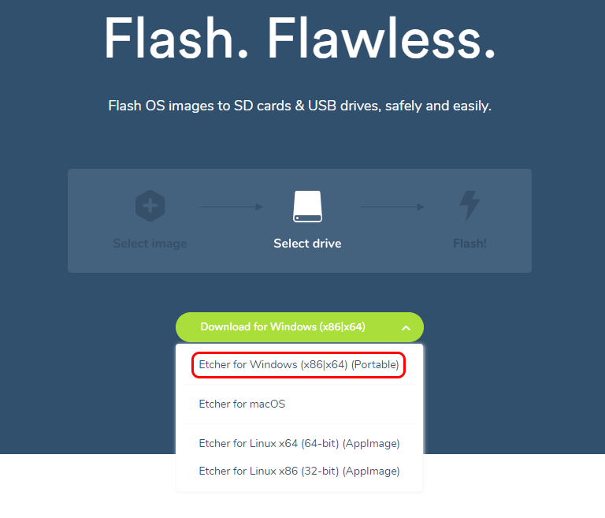
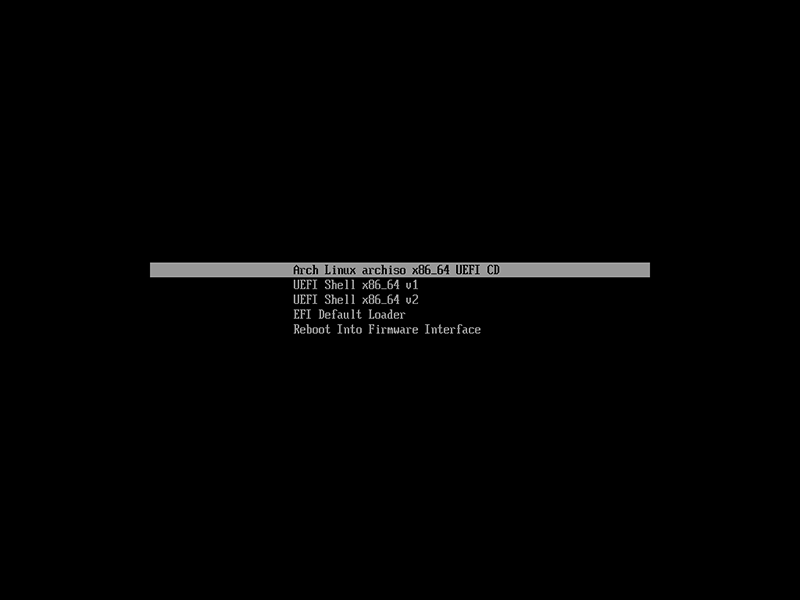
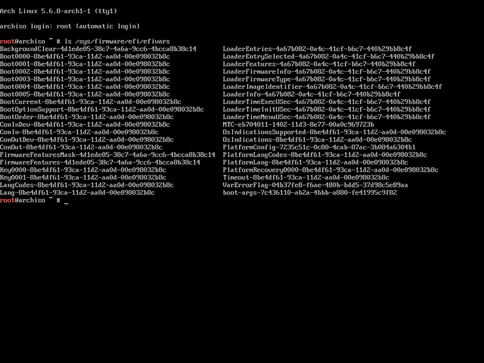

# 将 Arch Linux 安装在 LVM 分区上

Arch Linux 官网 [https://www.archlinux.org/](https://www.archlinux.org/)

## `Arch Linux` 是啥

看这里 [https://wiki.archlinux.org/index.php/Arch_Linux_(简体中文)](https://wiki.archlinux.org/index.php/Arch_Linux_(%E7%AE%80%E4%BD%93%E4%B8%AD%E6%96%87))

## `LVM` 分区又是啥

看这里 [https://wiki.archlinux.org/index.php/LVM_(简体中文)](https://wiki.archlinux.org/index.php/LVM_(%E7%AE%80%E4%BD%93%E4%B8%AD%E6%96%87))

## 安装前准备

### 下载 `Arch Linux ISO` 文件

下载地址: [https://www.archlinux.org/download/](https://www.archlinux.org/download/)

推荐用 `Bittorrent` 的方式下载

### 下载 `Etcher` U 盘制作工具

下载地址: [https://www.balena.io/etcher/](https://www.balena.io/etcher/)

建议下载免安装的 `Portable` 版本



## 安装到实体电脑上

准备一个 8G 容量以上的 U 盘，用 `Etcher` 将下载的 `ISO` 文件写入到 U 盘中

用 U 盘启动电脑，选择 `Arch Linux archiso x86_64 UEFI CD` 进入到 `Arch Linux` 安装系统



## 安装到虚拟机上

建议想要体验一下 `Arch Linux` 的小伙伴先在虚拟机上试试，有啥问题都很好解决

### Windows 上的虚拟机可以使用免费的 `VirtualBox` 虚拟机

下载地址: [https://www.virtualbox.org/wiki/Downloads](https://www.virtualbox.org/wiki/Downloads)

下载 `Windows hosts` 的安装包

> *如何使用虚拟机就自己网上找一下吧*

## `Arch Linux` 安装系统启动成功并以 `root` 管理员用户自动登陆


## 确认系统是否支持 `UEFI` 引导

查看 `/sys/firmware/efi/efivars` 这个目录是否存在，如果提示没有这个目录，那系统就不是 `UEFI` 引导的

要么是 `BIOS` 没有开 `UEFI`，要么就是主板太老不支持，本文主要针对可以用 `UEFI` 引导的系统制作硬盘引导分区，`BIOS` 引导的可以看官网的硬盘分区 [wiki](https://wiki.archlinux.org/index.php/Partitioning_(%E7%AE%80%E4%BD%93%E4%B8%AD%E6%96%87))

```bash
root@archiso ~ # ls /sys/firmware/efi/efivars
```



## 安装系统启动后先检查网络

`Arch Linux` 安装的时候需要联网下载软件包，如果电脑不能联网就无法安装

```bash
 root@archiso ~ # ip a
 root@archiso ~ # ping -c 5 baidu.com
```

## 如果未能自动获得局域网 `IP` 地址

```bash
root@archiso ~ # dhcpcd
```

## 若电脑使用的是无线网络

```bash
root@archiso ~ # wifi-menu
```

## 启动 `SSH` 服务

可从同一局域网内的电脑使用 `SSH` 登陆正在的安装 `Arch Linux` 的电脑进行后续安装

```bash
root@archiso ~ # systemctl start sshd
root@archiso ~ # systemctl status sshd
```

## 修改 `root` 密码

`SSH` 登陆需要密码

```bash
root@archiso ~ # passwd
```

## 从另一台电脑 `SSH` 登陆

把 `arch-ip` 换成前面检查网络时得到的局域网 `IP` 地址

用 `SSH` 登录的好处是长命令可以复制粘贴，比全部手打输入方便

> 这步操作是可选的

### `Linux` 终端登录 `SSH` 

```bash
~ $ ssh root@arch-ip
```

### `Windows 10` 自带 `OpenSSH` 客户端

使用 Windows 的 `命令提示符` 或者 `PowerShell` 登录 `SSH`

```powershell
C:\> ssh root@arch-ip
```

### 其他版本的 `Windows` 可以使用第三方的终端工具登陆 `SSH`

#### `PuTTY`

下载地址: [https://www.chiark.greenend.org.uk/~sgtatham/putty/latest.html](https://www.chiark.greenend.org.uk/~sgtatham/putty/latest.html)

> 建议下载免安装版的 `puttp.zip` 合集包

#### `MobaXterm`

下载地址: [https://mobaxterm.mobatek.net/download-home-edition.html](https://mobaxterm.mobatek.net/download-home-edition.html)

> 建议下载免安装 `Portable` 版。这是个收费软件，不过有提供个人使用的免费版，这个软件还提供很多插件，功能很强大

#### `XShell`

下载地址: [https://www.netsarang.com/zh/free-for-home-school/](https://www.netsarang.com/zh/free-for-home-school/)

> 这是个收费软件，不过有提供个人使用的免费版

### `SSH` 登录后会显示和安装电脑相同的终端提示符

```bash
root@archiso ~ # _
```

## 编辑镜像源列表，选择离自己近速度最快的源服务器

可以从 Arch Linux 官网生成中国的镜像源列表
[https://www.archlinux.org/mirrorlist/](https://www.archlinux.org/mirrorlist/) 

### 从官网获得中国的镜像源列表

```bash
root@archiso ~ # mv /etc/pacmand.d/mirrorlist /etc/pacman.d/mirrorlist.bak
root@archiso ~ # curl -s "https://www.archlinux.org/mirrorlist/?country=CN&protocol=https&ip_version=4" > /etc/pacman.d/mirrorlist
```

### 选择合适的镜像源，去掉源地址前面的 `#` 号注释

```bash
root@archiso ~ # nano /etc/pacman.d/mirrorlist
```

## 更新系统源数据库

```bash
root@archiso ~ # pacman -Syyy
```

## 查看硬盘分区情况

```bash
root@archiso ~ # fdisk -l
root@archiso ~ # lsblk
```

## 给硬盘分区

SATA/SAS/IDE 接口的机械硬盘、固态硬盘和 U 盘等系统会识别为 `/dev/sdX` 的设备，NVMe/PCI-e 的固态硬盘会识别为 `/dev/nvmeNnN` 的设备

将 `X` 或 `N` 替换为你硬盘实际对应的字母或数字，请仔细确认要分区的硬盘编号，搞错了硬盘中的数据将无法恢复

```bash
root@archiso ~ # fdisk /dev/sdX
```

### 查看现在的分区表

```fdisk
Command (m for help): p
```

### 创建 `GPT` 分区表

```fdisk
Command (m for help): g
```

### 新建 `EFI` 分区

> `#` 号后面的文字是注释说明，`Enter↵` 代表直接按键盘的 `Enter` 键不输入别的内容

```fdisk
Command (m for help):  n # 新建分区
Partition number (1-128, default 1): Enter↵ # 使用默认分区编号 1
First sector (2048-xxxxxxxx, default 2048): Enter↵ # 使用默认的分区起始扇区
Last sector, +/-sectors or +/-size{K,M,G,T,P} (2048-xxxxxxxx, default xxxxxxxx): +512M # 设置分区使用的容量
Command (m for help):  t # 设置分区类型
Selected partition 1
Partition type (type L to list all types): 1 # EFI 分区类型编号是 1
```

### 新建 `LVM` 分区

```fdisk
Command (m for help): n
Partition number (2-128, default 2): Enter↵ # 使用默认的分区编号 2
First sector (1050624-xxxxxxxx, default 1050624):  Enter↵ # 使用默认的分区起始扇区
Last sector, +/-sectors or +/-size{K,M,G,T,P} (1050624-xxxxxxxx, default xxxxxxxx): Enter↵ # 设置分区使用剩余所有容量
Command (m for help): t # 设置分区类型
Partition number (1,2, default 2): enter # 使用默认的分区编号 2
Partition type (type L to list all types): 30 # LVM 分区类型编号是 30
```

### 再次查看现在的分区表

```fdisk
Command (m for help): p
```

### 确认分区信息正确后保存并退出 `fdisk`

这将会擦除硬盘原有的分区信息，请务必确认分区信息正确，否则会造成硬盘内资料丢失，或者无法正常安装、启动系统

```fdisk
Command (m for help): w
```

## 查看硬盘分区情况

```bash
root@archiso ~ # lsblk
```

## 格式化 `EFI` 分区

`EFI` 分区需要格式化为 `FAT32` 格式的文件系统

```bash
root@archiso ~ # mkfs.fat -F32 /dev/sdX1
```

## 创建 `LVM` 分区

### 创建物理卷

使用 `SSD` 固态硬盘

```bash
root@archiso ~ # pvcreate --dataalignment 1m /dev/sdX2
```

使用机械硬盘

```bash
root@archiso ~ # pvcreate /dev/sdX2
```

### 创建卷组

`arch` 是卷组名称，可以替换为你想要的名称，名称只能由 `ASCII` 字符里的英文大小写字母、数字、加号、下划线、点和减号/连字符组成 `a-zA-Z0-9+_.-`，名称开头不能是减号/连字符，详细信息可在 [lvm(8)](https://jlk.fjfi.cvut.cz/arch/manpages/man/lvm.8#VALID_NAMES) 中查到

```bash
root@archiso ~ # vgcreate arch /dev/sdX2
```

### 创建逻辑卷

这里提供两种创建逻辑卷的思路，选择其中一个就行

#### 1. 只创建一个 `root` 逻辑卷

创建 `root` 逻辑卷并分配硬盘剩余的所有容量

> `arch` 是之前创建的卷组的名称，`lv_root` 是即将创建的逻辑卷的名称

```bash
root@archiso ~ # lvcreate -l 100%FREE arch -n lv_root
```

#### 2. 分别创建 `root` 和 `home` 逻辑卷

`root` 逻辑卷的容量至少给 15-20GB 会比较安全，不然后期安装软件可能会出现硬盘容量不足的情况

> `arch`是之前创建的卷组的名称，`lv_root` 和 `lv_home` 是即将创建的逻辑卷的名称

```bash
root@archiso ~ # lvcreate -L 15GB arch -n lv_root
root@archiso ~ # lvcreate -l 100%FREE arch -n lv_home
```

### 加载 `dm_mod` 模块

```bash
root@archiso ~ # modprobe dm_mod
```

### 扫描卷组

```bash
root@archiso ~ # vgscan
```

### 激活卷组

```bash
root@archiso ~ # vgchange -ay
```

## 格式化 `root` 逻辑卷

格式化逻辑卷可以使用`ext4`, `xfs`等文件系统，详细说明可以看官网 [wiki](https://wiki.archlinux.org/index.php/File_systems_(%E7%AE%80%E4%BD%93%E4%B8%AD%E6%96%87))

这里选择使用 `xfs` 文件系统

```bash
root@archiso ~ # mkfs.xfs /dev/arch/lv_root
```

## 挂载 `root` 逻辑卷

```bash
root@archiso ~ # mount /dev/arch/lv_root /mnt
```

### 如果选择创建了 `home` 逻辑卷

#### 新建 `home` 目录

```bash
root@archiso ~ # mkdir /mnt/home
```

#### 格式化 `home` 逻辑卷

```bash
root@archiso ~ # mkfs.xfs /dev/arch/lv_home
```

#### 挂载 `home` 逻辑卷

```bash
root@archiso ~ # mount /dev/arch/lv_home /mnt/home
```

## 安装 `Arch Linux` 基础系统软件包

```bash
root@archiso ~ # pacstrap -i /mnt base
```

## 生成 `fstab` 文件

```bash
root@archiso ~ # genfstab -U /mnt >> /mnt/etc/fstab
```

## 查看 fstab 文件

```bash
root@archiso ~ # cat /mnt/etc/fstab
```

## 切换到新安装的系统

```bash
root@archiso ~ # arch-chroot /mnt
```

切换系统后可以看到终端提示符发生了变化

```bash
[root@archiso /]# 
```

## 安装 `linux` 内核和常规硬件的固件

```bash
[root@archiso /]# pacman -S linux linux-headers linux-firmware
```

> 这里现在会有个提示让选择 `mkinitcpio` 或 `dracut`，现在先选择 `mkinitcpio`，`dracut` 还在测试阶段，新安装的系统选择会出现无法启动的问题

### 可选安装 `linux-lts` 内核

```bash
[root@archiso /]# pacman -S linux-lts linux-lts-headers
```

## 安装 `CPU Microde` 处理器微码

根据自己的 CPU 品牌选择安装，如果系统安装在 U 盘、移动硬盘等移动介质上，两个品牌的处理器微码可以都安装

> 处理器微码的资料可以在官网 [wiki](https://wiki.archlinux.org/index.php/Microcode_(%E7%AE%80%E4%BD%93%E4%B8%AD%E6%96%87)) 看到

### `Intel CPU`

```bash
[root@archiso /]# pacman -S intel-ucode
```

### `AMD CPU`

```bash
[root@archiso /]# pacman -S amd-ucode
```

## 安装其他系统必须的软件包

```bash
[root@archiso /]# pacman -S base-devel bash-completion dialog man-db man-pages nano openssh texinfo xfsprogs
```

## 系统启动时自动启动 `openssh` 服务

```bash
[root@archiso /]# systemctl enable sshd
```

## 安装网络相关软件包

```bash
[root@archiso /]# pacman -S networkmanager netctl
```

> 这里让选择 `openresolv` 或 `systemd-resolvconf`，默认是选择 `openresolv`

## 若需要使用无线网络还需要安装一些软件

```bash
[root@archiso /]# pacman -S crda wireless_tools
```

## 系统启动时自动启动网络相关服务

```bash
[root@archiso /]# systemctl enable NetworkManager
```

## 安装 `LVM2` 软件包

```bash
[root@archiso /]# pacman -S lvm2
```

## 生成系统启动的 `initramfs` 文件

### 编辑 `/etc/mkinitcpio.conf` 文件

编辑 `mkinitcpio` 配置文件，使得 `lvm2` 可以在系统启动时被加载

```bash
[root@archiso /]# nano /etc/mkinitcpio.conf
```

在 `/etc/mkinitcpio.conf` 文件的第 `52` 行或附近找到 `HOOKS=` 开头的一行，将 `lvm2` 添加到 `block` 和 `filesystems` 之间

> 在 `nano` 中按 `Ctrl+c` 可以查看光标当前所在行的行号，按 `Alt+Shift+3` 开启或关闭行号显示，按 `Alt+g` 可以跳转到指定的行

```nano
...
HOOKS=(base udev autodetect modconf block lvm2 filesystems keyboard fsck)
...
```

> 使用 `nano` 编辑完文件，按 `Ctrl+o` 保存文件，再按 `Ctrl+x` 退出 `nano`

### 生成 `initramfs` 文件

```bash
[root@archiso /]# mkinitcpio -P
```

## 设置时区

### 本地时区

```bash
[root@archiso /]# ln -sf /usr/share/zoneinfo/Asia/Shanghai /etc/localtime
```

### 生成 `/etc/adjtime` 文件

```bash
[root@archiso /]# hwclock --systohc
```

## 设置本地化环境

### 编辑 `/etc/locale.gen` 文件

```bash
[root@archiso /]# nano /etc/locale.gen
```

移除 `en_US.UTF-8` 和 `zh_CN.UTF-8 UTF-8` 前的 `#` 号注释

```nano
...
en_US.UTF-8
...
zh_CN.UTF-8 UTF-8
...
```

### 生成 `locale` 信息

```bash
[root@archiso /]# locale-gen
```

### 设置系统区域语言环境

```bash
[root@archiso /]# echo 'LANG=en_US.UTF-8' | tee -a /etc/locale.conf
```

## 创建 `hostname` 文件

`hostname` 就是你的系统名称，将 `arch` 替换为你想要的名称，只能使用 `ASCII` 字符里的英文大小写字母、数字和减号/连字符组成 `a-zA-Z0-9-`，不能含有空格、其他的标点符号、下划线和中文字符，名称开头和结尾不能是减号/连字符，最好也不要用数字开头，详细说明可以看这里 [hostname(5)](https://jlk.fjfi.cvut.cz/arch/manpages/man/community/man-pages-zh_cn/hostname.5.zh_CN)

```bash
[root@archiso /]# echo 'arch' > /etc/hostname
```

## 修改 `hosts` 文件

```bash
[root@archiso /]# nano /etc/hosts
```

```nano
# Static table lookup for hostnames.
# See hosts(5) for details.

127.0.0.1 localhost.localdomain	localhost
127.0.1.1 arch.localdomain	arch
```

## 安装系统引导软件

```bash
[root@archiso /]# pacman -S grub efibootmgr dosfstools os-prober mtools
```

## 创建 `EFI` 目录

```bash
[root@archiso /]# mkdir /boot/EFI
```

## 挂载 `EFI` 分区

```bash
[root@archiso /]# mount /dev/sdX1 /boot/EFI
```

## 安装 `GRUB` 启动加载器

```bash
[root@archiso /]# grub-install --target=x86_64-efi --bootloader-id=Arch --recheck
```

## 创建 `GRUB` 的 `locale` 目录

```bash
[root@archiso /]# mkdir /boot/grub/locale
```

## 复制 `grub.mo` 文件到 `GRUB` 的 `locale` 目录

```bash
[root@archiso /]# cp /usr/share/locale/en\@quot/LC_MESSAGES/grub.mo /boot/grub/locale/en.mo
```

## 生成 `GRUB` 菜单配置文件

```bash
[root@archiso /]# grub-mkconfig -o /boot/grub/grub.cfg
```

## 创建 `swapfile` 交换空间文件

### 手动创建 `swapfile` 文件

> `swapfile` 文件的大小一般设置为等于内存大小或是内存的2倍

```bash
[root@archiso /]# fallocate -l 1G /swapfile
[root@archiso /]# chmod 0600 /swapfile
[root@archiso /]# mkswap /swapfile
[root@archiso /]# cp /etc/fstab /tmp/fstab.bak
[root@archiso /]# echo -e '# swapfile\n/swapfile none swap sw 0 0' | tee -a /etc/fstab
[root@archiso /]# cat /etc/fstab
```

### 使用 `systemd-swap` 自动创建交换空间文件

详细信息请看官网的 [wiki](https://wiki.archlinux.org/index.php/Swap_(%E7%AE%80%E4%BD%93%E4%B8%AD%E6%96%87)#%E8%87%AA%E5%8A%A8%E5%8C%96)

### 优化 `swapfile` 使用率

```bash
[root@archiso /]# echo 'vm.swappiness = 5' | tee -a /etc/sysctl.d/99-swappiness.conf
[root@archiso /]# echo 'vm.vfs_cache_pressure=50' | tee -a /etc/sysctl.d/99-vfs_cache_pressure.conf
```

## 安装显卡驱动

### `Intel` 显卡

```bash
[root@archiso /]# pacman -S mesa vulkan-intel
```

<!--
#### 硬件视频加速支持

`Broadwell` 系列集显

```bash
[root@archiso /]# pacman -S intel-media-driver
```

`Coffe Lake` 系列集显

```bash
[root@archiso /]# pacman -S libva-intel-driver
```
-->

### `AMD` 显卡

```bash
[root@archiso /]# pacman -S amdvlk mesa vulkan-radeon
```

<!--
#### 硬件视频加速支持

`AMDGPU` 和 `AMDGPU PRO`

```bash
[root@archiso /]# pacman -S libva-mesa-driver mesa-vdpau
```
-->

### `Nvidia` 显卡

```bash
[root@archiso /]# pacman -S nvidia nvidia-utils
```

如同时安装了 `linux-lts` 内核

```bash
[root@archiso /]# pacman -S nvidia-lts
```

<!--
#### 硬件视频加速支持

> `Nvidia` 显卡的硬件视频加速由 `nvidia-utils` 提供支持
-->

### `Arch Linux` 安装在 `Virtualbox` 虚拟机中

安装虚拟机客户端增强工具和显示驱动

```bash
[root@archiso /]# pacman -S libva-mesa-driver mesa-vdpau virtualbox-guest-utils xf86-video-vmware
[root@archiso /]# systemctl enable vboxservice
```

## 设置 `root` 密码

```bash
[root@archiso /]#  passwd
```

## 创建自己的用户名并设置密码

把  `username` 换成你自己的用户名

```bash
[root@archiso /]# useradd -m -G wheel username
[root@archiso /]# passwd username
```

## 安装 `sudo` 命令

```bash
[root@archiso /]# pacman -S sudo
```

### 允许 `wheel` 组用户使用 `sudo` 命令

> 系统默认的文本编辑器是 `vim`，这里临时改成 `nano`，习惯用 `vim` 的也可以自己安装使用

```bash
[root@archiso /]# EDITOR=nano visudo
```

在第 `82` 行左右，将 `%wheel ALL=(ALL) ALL` 前的 `#` 号注释去掉

```nano
...
%wheel ALL=(ALL) ALL
...
```

## `Arch Linux` 安装完成，重启系统验证是否成功安装

### 退出 `chroot` 环境

```bash
[root@archiso /]# exit
```

> 或者按 `Ctrl+d`

### 卸载所有挂载点

```bash
root@archiso ~ # umount -a
```

> 可忽略出现的错误提示

### 重启系统

```bash
root@archiso ~ # reboot
```

*见证奇迹的时刻*

## 安装后的工作

系统重启成功，后续还有对系统网络安全设置、系统优化、安装图形界面、中文化、安装中文字体和个性化等的工作，可以先看看官方的文档

  - [https://wiki.archlinux.org/index.php/General_recommendations_(简体中文)](https://wiki.archlinux.org/index.php/General_recommendations_(%E7%AE%80%E4%BD%93%E4%B8%AD%E6%96%87))
  - [https://wiki.archlinux.org/index.php/Localization/Simplified_Chinese_(简体中文)](https://wiki.archlinux.org/index.php/Localization/Simplified_Chinese_(%E7%AE%80%E4%BD%93%E4%B8%AD%E6%96%87))

#

##### 参考资料

  - [https://wiki.learnlinux.tv/index.php/How_to_Install_Arch_Linux_on_LVM](https://wiki.learnlinux.tv/index.php/How_to_Install_Arch_Linux_on_LVM)
  - [https://wiki.archlinux.org/index.php/Installation_guide_(简体中文))](https://wiki.archlinux.org/index.php/Installation_guide_(%E7%AE%80%E4%BD%93%E4%B8%AD%E6%96%87))
  - [https://wiki.archlinux.org/index.php/Install_Arch_Linux_on_LVM#Adding_mkinitcpio_hooks](https://wiki.archlinux.org/index.php/Install_Arch_Linux_on_LVM#Adding_mkinitcpio_hooks)
  - [https://wiki.archlinux.org/index.php/Mkinitcpio_(简体中文))](https://wiki.archlinux.org/index.php/Mkinitcpio_(%E7%AE%80%E4%BD%93%E4%B8%AD%E6%96%87))
  - [https://wiki.archlinux.org/index.php/Arch_boot_process_(简体中文)#启动加载器](https://wiki.archlinux.org/index.php/Arch_boot_process_(%E7%AE%80%E4%BD%93%E4%B8%AD%E6%96%87)#%E5%90%AF%E5%8A%A8%E5%8A%A0%E8%BD%BD%E5%99%A8)
  - [https://wiki.archlinux.org/index.php/GRUB_(简体中文)](https://wiki.archlinux.org/index.php/GRUB_(%E7%AE%80%E4%BD%93%E4%B8%AD%E6%96%87))
