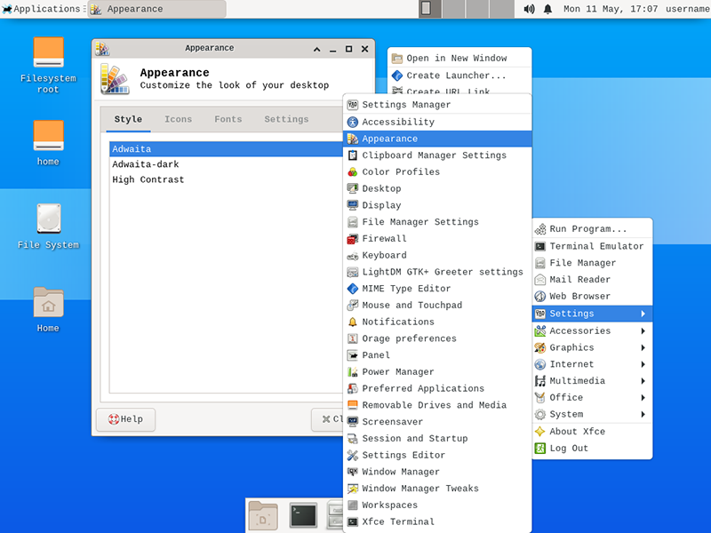
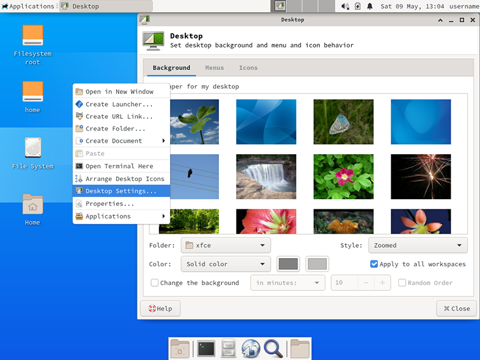

# 在 Arch Linux 上安装 Xfce 桌面环境

## 前言

黑黑的终端界面，干啥都要敲入各种的命令，实在是太不友好了，使用体验实在是太差了。

亲，不要怕，`Linux` 是可以安装桌面环境哒。

## 安装桌面环境

`Linux` 的桌面环境有很多选择，有 `GNOME`, `KDE Plasma`, `Xfce` `Openbox` 和 `LXDE` 等等就不一一列举了，想了解更多信息可以看官方 [wiki](https://wiki.archlinux.org/index.php/Desktop_environment_(%E7%AE%80%E4%BD%93%E4%B8%AD%E6%96%87)) 。

> 这里选择使用轻量化的 `Lightdm` 显示管理器和 `Xfce` 桌面环境

### 安装 `Xorg-server`

```bash
[username@arch ~]$ sudo pacman -S xorg-server
```

### 安装并启动 `lightdm` 显示管理器

```bash
[username@arch ~]$ sudo pacman -S accountsservice lightdm lightdm-gtk-greeter lightdm-gtk-greeter-settings
[username@arch ~]$ sudo systemctl enable lightdm
```

### 安装 `xfce` 桌面环境

```bash
[username@arch ~]$ sudo pacman -S xfce4 xfce4-dev-tools xfce4-goodies xfce4-terminal
```

*这里会出现一些安装选项*

> 出现这个选项时直接按 `Enter` 键选择默认的全部安装

```bash
Enter a selection (default=all):
```

> 出现选择 `jack` 或 `jack2` 时，选择默认的 `jack` 选项

*基本的桌面环境已经安装好，可以重启系统进入桌面环境了*

```bash
[username@arch ~]$ sudo shutdown -r now
```

*安装完桌面系统第一次重启后显示的图形登录窗口*


> 一个登录窗口，黑黑的背景。别害怕，登录一次系统后，这里的背景就会显示用户的桌面背景图了


*系统桌面*


> 这个桌面好丑啊。真的不要害怕，桌面外观是可以个性化修改[更换外观主题](arch-linux-install-xfce-desktop-environment.md#更换外观主题)。`Xfce` 自带有外观主题，更多主题从这个网站下载 [https://www.xfce-look.org/](https://www.xfce-look.org/)

### 安装一些常用的软件和插件

#### 系统没有声音，无法调整音量


*需要下载声音管理软件*

打开终端模拟器 `Terminal Emulator`


```bash
[username@arch ~]$ sudo pacman -S pavucontrol pulseaudio
[username@arch ~]$ sudo shutdown -r now
```

> 安装完声音管理软件，重启系统后系统就有了声音，可以正常调整音量了


#### 安装浏览器

> 常用浏览器有 `chromium` 和 `firefox`，按照自己的喜好选择安装，或者可以都安装

```bash
[username@arch ~]$ sudo pacman -S chromium firefox
```

*打开浏览器*

> 桌面底部面板图标打开浏览器


> 桌面鼠标右键菜单打开浏览器


> 桌面顶部菜单打开浏览器


*修改 `Web Browser` 快捷方式打开的浏览器*

> 桌面鼠标右键打开 `Preferred Applications` 设置


> 或桌面顶部菜单打开 `Preferred Applications` 设置


> 修改 `Web Browser` 为要想要打开的浏览器


### 个性化外观

#### 更换外观主题和窗口样式

打开 `appearance` 外观设置，选择想要更换的外观主题

*从屏幕顶上菜单打开*


*从桌面右键菜单打开*



*选择外观主题*


打开 `Window Manager` 窗口管理，选择想要的窗口样式

*从屏幕顶上菜单打开*


*从桌面右键菜单打开*


*选择窗口样式*


> 更多外观主题和窗口样式可以去 [xfce-look.org](https://www.xfce-look.org) 下载

#### 更换桌面背景图

在桌面上按鼠标右键选 `Desktop Settings` 打开桌面设置，可以选系统自带的桌面背景图，或者使用自己下载的



也可以从顶部菜单 `Applications` > `Settings` > `Desktop` 打开桌面设置


*使用自己下载的桌面背景图*

> 可以下载 `Arch Linux` 的官方桌面背景：
> 使用浏览器打开 [`https://sources.archlinux.org/other/artwork/`](https://sources.archlinux.org/other/artwork/) 网址，下载 [`archlinux-wallpaper-1.4.tar.xz`](https://sources.archlinux.org/other/artwork/archlinux-wallpaper-1.4.tar.xz) 背景图压缩包到 `Downloads` 目录
> 解压缩并将背景图复制到系统背景图目录中

*终端模拟器解压缩*

```bash
[username@arch ~]$ cd Downloads/
[username@arch Downloads]$ tar -Jxvf archlinux-wallpaper-1.4.tar.xz
[username@arch Downloads]$ cd archlinux-wallpaper-1.4/
[username@arch archlinux-wallpaper-1.4]$ ls
```

*图形界面解压缩*

打开 `File Manager`


双击 `Downloads` 目录进入，在下载的压缩包文件上点鼠标右键 `archlinux-wallpaper-1.4.tar.xz` 选择 `Extract Here`


> 啥情况，并不能解压啊。别急，这是没有安装图形界面的解压缩工具，安装 `xarchiver` 就可以解决
> 

```bash
[username@arch ~]$ sudo pacman -S xarchiver
```

> 此时再解压就没有问题了

*复制到系统背景图目录*

```bash
[username@arch Downloads]$ sudo cp -r archlinux-wallpaper-1.4 /usr/share/backgrounds/archlinux
```

*选择一个喜欢的背景图换上*

  1. 选择 `Folder` > `Other` 打开选择目录窗口

    

  2. 在 `backgrounds` 目录下选择刚上传的 `archlinux` 目录

    

  3. 选择一个喜欢的背景图换上

    

  4. 按 `Close` 按钮退出桌面设置，就可以看到更换背景后的效果

    


##### 参考资料

  - [https://wiki.archlinux.org/index.php/Xorg_(简体中文)](https://wiki.archlinux.org/index.php/Xorg_(%E7%AE%80%E4%BD%93%E4%B8%AD%E6%96%87))
  - [https://wiki.archlinux.org/index.php/Display_manager_(简体中文)](https://wiki.archlinux.org/index.php/Display_manager_(%E7%AE%80%E4%BD%93%E4%B8%AD%E6%96%87))
  - [https://wiki.archlinux.org/index.php/LightDM_(简体中文)](https://wiki.archlinux.org/index.php/LightDM_(%E7%AE%80%E4%BD%93%E4%B8%AD%E6%96%87))
  - [https://wiki.archlinux.org/index.php/Desktop_environment_(简体中文)](https://wiki.archlinux.org/index.php/Desktop_environment_(%E7%AE%80%E4%BD%93%E4%B8%AD%E6%96%87))
  - [https://wiki.archlinux.org/index.php/Xfce_(简体中文)](https://wiki.archlinux.org/index.php/Xfce_(%E7%AE%80%E4%BD%93%E4%B8%AD%E6%96%87))
