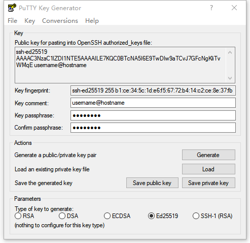
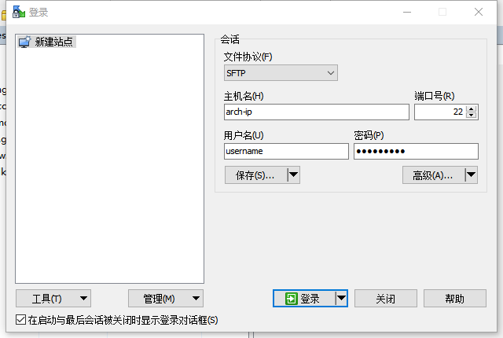
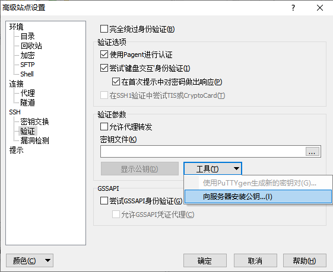

# Arch Linux 安装完成后的一些工作

## 前言

这章主要讲一下在 `Arch Linux` 安装好后，需要做的一些系统设置。例如开启防火墙，加固 `SSH` 服务的安全，安装更多的工具软件，对一些系统软件的配置等。写比较杂乱，将就着看吧。

## `Arch Linux` 启动成功后会显示登录提示符

使用在安装系统时创建的用户名和密码登录系统

> 非必要不要直接使用 `root` 管理员用户登录


### 系统登录成功会显示终端提示符

```bash
[username@arch ~]$ _
```

> `username` 是你的用户名；`arch` 是在安装时设置的系统名称；`～` 显示当前所在的目录为 `home` 目录，会随着目录改变而变。

## 首先检查系统更新

```bash
[username@arch ~]$ sudo pacman -Syyy
[username@arch ~]$ sudo pacman -Syu
```

> 使用 `sudo` 命令时会提示输入当前用户的密码

如果更新系统时 `linux` 内核有更新，完成更新后最好重启一下系统

```bash
[username@arch ~]$ sudo shutdown -r now
```

## 检查系统时间并开启网络时间同步

```bash
[username@arch ~]$ sudo timedatectl set-ntp true
[username@arch ~]$ timedatectl status
```

## 确认 `SSH` 服务随系统自动启动了

```bash
[username@arch ~]$ sudo systemctl status sshd
```

如果 `SSH` 服务没有自动启动，可以手动启动

```bash
[username@arch ~]$ sudo systemctl enable sshd
[username@arch ~]$ sudo systemctl start sshd
[username@arch ~]$ sudo systemctl status sshd
```

## 从另一台电脑 `SSH` 登录安装了 `Arch Linux` 的电脑

*`Linux` 系统登录*

```bash
user@hostname ~$ ssh username@arch-ip
```

*`Windows 10` 系统登录*

```powershell
C:\> ssh username@arch-ip
```

*其他 `Windows` 系统登录*

可以使用 `PuTTY`、`MobaXterm` 或 `XShell` 等第三方的终端工具登录

> 将 `username` 和 `arch-ip` 换成 `Arch Linux` 系统的用户名和 `IP` 地址

如果登录时出现下面这样的错误提示，需要删掉之前记录的 `host key`

```powershell
C:\> ssh username@arch-ip
@@@@@@@@@@@@@@@@@@@@@@@@@@@@@@@@@@@@@@@@@@@@@@@@@@@@@@@@@@@
@    WARNING: REMOTE HOST IDENTIFICATION HAS CHANGED!     @
@@@@@@@@@@@@@@@@@@@@@@@@@@@@@@@@@@@@@@@@@@@@@@@@@@@@@@@@@@@
IT IS POSSIBLE THAT SOMEONE IS DOING SOMETHING NASTY!
...
```

> `Windows` 系统一般在 `C:\Users\user\.ssh\known_hosts` 这个文件里
> `Linux` 系用一般在 `/home/user/.ssh/known_hosts` 这个文件里
> 将和 `Arch Linux` 系统 `IP` 地址相同的那一行记录删除，或者将 `known_hosts` 这个文件删掉就可以正常登录了

## 加固 `SSH` 服务的安全

通常加固 `SSH` 服务安全的方式有关闭密码登录使用 `SSH Key` 密钥登录，更换默认端口号，禁止使用 `root` 用户登录等，更详细信息可以看官网 [wiki](https://wiki.archlinux.org/index.php/Secure_Shell_(%E7%AE%80%E4%BD%93%E4%B8%AD%E6%96%87))

### 在你的本地电脑上生成 `SSH Key` 密钥对

> 如果电脑里已经有 `SSH Key` 密钥可以跳过这步

`SSH Key` 密钥对建议使用 `ed25519` 的加密方式，加密方式的详细信息可以看官方 [wiki](https://wiki.archlinux.org/index.php/SSH_keys#Choosing_the_authentication_key_type)

#### `Linux` 和 `Windows 10` 自带的 `OpenSSH` 客户端可以生成 `SSH Key` 密钥对

打开 `Linux` 的终端，用 `ssh-keygen` 生成密钥对

```bash
user@hostname ~$ ssh-keygen -t ed25519
```

打开 `Windows` 的 `命令提示符` 或 `PowerShell`，用 `ssh-keygen` 生成密钥对

```powershell
C:\> ssh-keygen -t ed25519
```

`Linux` 默认保存在 `/home/user/.ssh/` 目录下，`Windows 10` 默认保存在 `C:\Users\user/.ssh/` 目录下，`ed25519` 加密方式生成的密钥对默认文件名是 `id_ed25519` 和 `id_ed25519.pub`。`id_ed25519` 是密钥文件不能外泄，`id_ed25519.pub` 是公钥文件，上传这个文件到需要 `SSH` 登录系统上。

> 生成密钥对时会询问是否使用密码加密密钥，有密码会更安全，但是每次登录时都是提示输入密码，不过也可以用 [ssh-agent](https://wiki.archlinux.org/index.php/SSH_keys_(%E7%AE%80%E4%BD%93%E4%B8%AD%E6%96%87)#SSH_agents) 来解决这个小麻烦，所以建议使用有密码的 `SSH Key` 密钥。

> 生成密钥对时可以添加其他参数，详细的使用说明可以在 [ssh-keygen(1)](https://jlk.fjfi.cvut.cz/arch/manpages/man/ssh-keygen.1) 查看

#### `Windows` 系统上还可以使用 `PuTTY` 提供的 `puttygen.exe` 程序来生成密钥对

打开 `puttygen.exe` 软件，选择 `Ed25519` 加密方式，然后按 `Generate`，会有提示在进度条下面移动鼠标产生随机信息来生成密钥。密钥生成后可以修改密钥注释和添加密码。然后点 `Save private key` 保存密钥，再点 `Save public key` 保存公钥，文件名取一个自己能记住的就行



### 上传 `SSH Key` 公钥到需要 `SSH` 登录的 `Arch Linux` 的电脑上

#### `Linux` 自带的 `OpenSSH` 客户端有自带的上传工具

`ssh-copy-id` 可以自动上传公钥到目标电脑，并将公钥添加到 `authorized_keys` 文件中

```bash
user@hostname ~$ ssh-copy-id -i ~/.ssh/id_ed25519.pub username@arch-ip
```

#### `Windows 10` 可以使用手动的方式上传公钥

`Windows 10` 从 `命令提示符` 或 `PowerShell` 先上传公钥的目标电脑，然后 `SSH` 登录上去

```powershell
C:\> scp  C:\Users\username/.ssh/id_ed25519 username@arch-ip:
C:\> ssh username@arch-ip
```

将公钥添加到 `authorized_keys` 文件中

```bash
[username@arch ~]$ ls -al ~
[username@arch ~]$ mkdir ~/.ssh
[username@arch ~]$ chmod 700 ~/.ssh
[username@arch ~]$ cat ~/id_ed25519.pub >> ~/.ssh/authorized_keys
[username@arch ~]$ rm ~/id_ed25519.pub
[username@arch ~]$ chmod 600 ~/.ssh/authorized_keys
[username@arch ~]$ exit
```

> 这段命令是先查看当前用户的 `home` 目录下所有文件和文件夹包括隐藏的，确认 `id_ed25519.pub` 文件存在。如果没有 `.ssh` 这个目录就创建一个并修改目录权限为只有自己可以访问，然后将 `id_ed25519.pub` 的内容追加到 `authorized_keys` 文件中，如果这个文件不存在会自动创建一个。最后删除 `id_ed25519.pub` 文件，并修改 `authorized_keys` 文件权限为只有自己可以读写，退出 `SSH` 登录。

#### `Windows` 系统还可以使用 `WinSCP` 来向上传公钥

下载地址: [https://winscp.net/eng/downloads.php](https://winscp.net/eng/downloads.php)

> 推荐下载免安装的 `Portable` 版本

`WinSCP` 有中文界面，不过需要另外下载一个语言文件

下载地址: [https://winscp.net/eng/translations.php](https://winscp.net/eng/translations.php)

> 找到 `Simplified Chinese`，点旁边的 `Download`，解压下载好的语言包，和 `WinSCP.exe` 放到同一个文件夹中就行

打开 `WinSCP`，在新建站点中填入要登录电脑的 `IP`、`用户名` 和 `密码` 后` 保存` 站点，然后先登录一次再退出会话到登录列表



在登录列表里选择保存的站点按 `编辑`，再按旁边的 `高级 `打开高级站点设置，选择 `SSH` 下的 `验证`，点 `工具` 后再点 `向服务器安装公钥`，然后选择用 `puttygen.exe` 生成的密钥 `ppk` 文件，按提示就能将公钥上传到目标电脑中



这时候再用 `SSH` 登录就会使用 `SSH Key` 来验证，如果生成密钥时没有设置密码，会免密直接登录上去；如果有设置密钥密码会提示输入密钥的密码而不是用户的密码

### 修改 `SSH` 服务的配置文件

用 `SSH` 登录上 `Arch Linux` 系统后，编辑 `/etc/ssh/sshd_config` 文件

```bash
[username@arch ~]$ sudo nano /etc/ssh/sshd_config
```

按需修改配置选项，下面只给出一些常规的配置建议，详细的配置信息可以在 [ssh_config(5)](https://jlk.fjfi.cvut.cz/arch/manpages/man/ssh_config.5) 中查到

```nano
Port 233 # SSH 监听的端口号，默认是 22，建议改成别的，但不要和别的服务端口冲突，端口号最大是 65535。常用服务使用的端口号可以在这个文件中查到 /etc/services
AddressFamily inet # 只监听 IPv4 地址，如果你的局域网内有 IPv6 可以不改这个选项 
HostKey /etc/ssh/ssh_host_ed25519_key # 只启用服务端 ed25519 加密方式的 Host Key
PermitRootLogin no # 禁用 root 用户登录
PasswordAuthentication no # 禁用密码登录，设置这个选项前，请确保已经向目标电脑上传了 SSH Key 公钥并能用密钥正常登录
UsePAM no
X11Forwarding no
#Subsystem      sftp    /usr/lib/ssh/sftp-server # 这个选项会在客户端使用 sftp 协议登录时单独开启一个 sftp-server 的进程。建议禁用掉，在最前面加个 # 号注释就可以禁用
Subsystem       sftp	internal-sftp # 这个选项使用 OpenSSH 服务内置的 sftp 服务，不会单独开启一个 sftp 的进程，这个选项需要自己手动添加
```

修改并保存配置文件后，可以先测试一下配置文件有无问题

```bash
[username@arch ~]$ sudo sshd -t
```

> 如果没有返回任何信息就说明配置文件没有问题，如果有错误返回就按照错误提示更正配置文件

配置文件测试没有问题就可以重启 `SSH` 服务，重启服务不会断开现有的 `SSH` 连接，可以在本地电脑新开一个终端窗口登录测试，如能正常登录 `SSH` 的配置就修改成功了

```bash
[username@arch ~]$ sudo systemctl restart sshd
```

如果修改了 `SSH` 服务的监听端口，在登录时候需要指定登录端口号，`ssh` 命令使用 `-p` 参数，`scp` 命令使用 `-P` 参数，命令的详细参数使用说明可以在 [`ssh(1)`](https://jlk.fjfi.cvut.cz/arch/manpages/man/community/man-pages-zh_cn/ssh.1.zh_CN) 和 [`scp(1)`](https://jlk.fjfi.cvut.cz/arch/manpages/man/community/man-pages-zh_cn/scp.1.zh_CN) 查看

```bash
user@hostname ~$ ssh -p 233 username@arch-ip
user@hostname ~$ scp -P 233 /local/path/to/folder/filename username@arch-ip:/remote/path/to/folder/filename
```

## 防火墙

常用防火墙管理工具有 `FirewallD` 和 `UFW`，选择一个使用即可

> 防火墙规则设置的内容很多，这里只简单讲一下安装启动防火墙，初始设置和针对 `SSH` 服务的设置。详细的防火墙设置可以看官网 `wiki` 和防火墙的使用手册：
> `FirewallD`: `Arch Linux` 官网 [`wiki`](https://wiki.archlinux.org/index.php/Firewalld), [使用手册](https://firewalld.org/documentation/)
> `UFW`: `Arch Linux` 官网 [`wiki`](https://wiki.archlinux.org/index.php/Uncomplicated_Firewall), [使用手册](https://help.ubuntu.com/community/UFW)

### `FirewallD`

安装 `FirewallD` 并启用服务

```bash
[username@arch ~]$ sudo pacman -S firewalld
[username@arch ~]$ sudo systemctl enable firewalld
```

简单设置防火墙规则，详细使用说明可以看官网 [wiki](https://wiki.archlinux.org/index.php/Firewalld) 和命令帮助 [firewall-cmd(1)](https://jlk.fjfi.cvut.cz/arch/manpages/man/community/firewalld/firewall-cmd.1.en), [firewall-offline-cmd(1)](https://jlk.fjfi.cvut.cz/arch/manpages/man/community/firewalld/firewall-offline-cmd.1.en)

> `FirewallD` 有两个终端命令行工具 `firewall-cmd` 、`firewall-offline-cmd` 和一个图形界面工具 `firewall-config`
> `firewall-cmd`在防火墙在线的时候使用
> `firewall-offline-cmd` 在防火墙离线的时候使用

先查看一下防火墙的状态

```bash
[username@arch ~]$ sudo firewall-cmd --state
```

> 一般新安装的防火墙是处在离线状态的

如果防火墙是离线状态，使用 `firewall-offline-cmd` 设置防火墙规则。`firewall-offline-cmd` 设置的是永久规则。

> 查看防火墙现有的规则，默认的 `zone` 是 `public`

```bash
[username@arch ~]$ sudo firewall-offline-cmd --get-default-zone
[username@arch ~]$ sudo firewall-offline-cmd --zone=public --list-all
[username@arch ~]$ sudo firewall-offline-cmd --zone=public --list-ports
[username@arch ~]$ sudo firewall-offline-cmd --zone=public --list-services
```

> 设置 `SSH` 服务规则。如果使用的是默认 `22` 端口，设置时可以使用服务名 `ssh`；如果修改成了别的端口号，设置时需要指定端口号。

*`SSH` 服务使用默认端口号*

> `FirewallD` 默认允许了 `SSH` 的 `22` 端口，此时直接启动防火墙就可以了。如果默认 `SSH` 服务没有在防火墙规则中启用，可以自己添加。

```bash
[username@arch ~]$ sudo firewall-offline-cmd --zone=public --add-service=ssh
```

*`SSH` 服务使用自定义端口号，例如 `233`*

```bash
[username@arch ~]$ sudo firewall-offline-cmd --zone=public --add-port=233/tcp
```

*删除规则*

> 删除自定义端口规则

```bash
[username@arch ~]$ sudo firewall-offline-cmd --zone=public --remove-port=233/tcp
```

> 删除内置服务规则

```bash
[username@arch ~]$ sudo firewall-offline-cmd --zone=public --remove-service-from-zone=ssh
```

*或*

> 删除默认 `zone` 里的服务规则

```bash
[username@arch ~]$ sudo firewall-offline-cmd --remove-service=ssh
```

*防火墙规则设置完成启动防火墙*

> 这将断开或阻止所有不在防火墙允许规则中的网络连接，请在启动防火墙前确定 `SSH` 的端口在防火墙的允许规则中

```bash
[username@arch ~]$ sudo systemctl start firewalld
```

如果防火墙是在线状态，使用 `firewall-cmd` 设置防火墙规则。`firewall-cmd` 默认设置的是临时规则，防火墙重新加载规则或重启后就会失效，有两种方法设置成永久规则：

  - 使用 `--permanent` 参数。添加了这个参数，设置的是永久规则但规则不会即时生效，需要重新加载规则或重启防火墙后才会生效。
  - 使用 `firewall-cmd --runtime-to-permanent` 这个命令将临时规则转为永久规则。

> 查看防火墙现有的规则，默认的 `zone` 是 `public`，并且处于激活状态

```bash
[username@arch ~]$ sudo firewall-cmd --get-default-zone
[username@arch ~]$ sudo firewall-cmd --get-active-zones 
[username@arch ~]$ sudo firewall-cmd --zone=public --list-all
[username@arch ~]$ sudo firewall-cmd --zone=public --list-ports
[username@arch ~]$ sudo firewall-cmd --zone=public --list-services
```

> 设置 `SSH` 服务规则。如果使用的是默认 `22` 端口，设置时可以使用服务名 `ssh`；如果修改成了别的端口号，设置时需要指定端口号。

*`SSH` 服务使用默认端口号*

> `FirewallD` 默认允许了 `SSH` 服务，此时直接启动防火墙就可以了。如果默认 `SSH` 服务没有在防火墙规则中启用，可以自己添加。

```bash
[username@arch ~]$ sudo firewall-cmd --zone=public --add-service=ssh
```

*或*

```bash
[username@arch ~]$ sudo firewall-cmd --zone=public --add-service=ssh --permanent
```

*`SSH` 服务使用自定义端口号，例如 `233`*

```bash
[username@arch ~]$ sudo firewall-cmd --zone=public --add-port=233/tcp
```

*或*

```bash
[username@arch ~]$ sudo firewall-cmd --zone=public --add-port=233/tcp --permanent
```

*删除规则*

> 删除自定义端口规则

```bash
[username@arch ~]$ sudo firewall-cmd --zone=public --remove-port=233/tcp
```

*或*

```bash
[username@arch ~]$ sudo firewall-cmd --zone=public --remove-port=233/tcp --permanent
```

> 删除内置服务规则

```bash
[username@arch ~]$ sudo firewall-cmd --zone=public --remove-service=ssh
```

*或*

```bash
[username@arch ~]$ sudo firewall-cmd --zone=public --remove-service=ssh --permanent
```

*将临时规则转为永久规则*

```bash
[username@arch ~]$ sudo firewall-cmd --runtime-to-permanent
```

*防火墙规则设置完成重新加载规则或重启防火墙*

> 这将断开或阻止所有不在防火墙允许规则中的网络连接，请在启动防火墙前确定 `SSH` 的端口在防火墙的允许规则中

```bash
[username@arch ~]$ sudo firewall-cmd --reload
```

*或*

```bash
[username@arch ~]$ sudo systemctl restart firewalld
```

### `UFW`

安装 `UFW` 并启用服务

```bash
[username@arch ~]$ sudo pacman -S ufw
[username@arch ~]$ sudo systemctl enable ufw
```

简单设置防火墙规则，详细使用说明可以看官网 [wiki](https://wiki.archlinux.org/index.php/Uncomplicated_Firewall) 和命令帮助 [ufw(8)](http://manpages.ubuntu.com/manpages/focal/en/man8/ufw.8.html) 

> `UFW` 只有一个终端命令行工具 `ufw` 、没有自带的图形界面工具，需要另外安装一个 [`gufw`](https://www.archlinux.org/packages/?name=gufw) 的软件包


先查看一下防火墙的状态

```bash
[username@arch ~]$ sudo ufw status
```

> 一般新安装的防火墙是处在离线状态的

设置防火墙规则

*先设置两条全局默认规则*

```bash
[username@arch ~]$ sudo ufw default deny incoming
[username@arch ~]$ sudo ufw default allow outgoing
```

> 设置 `SSH` 服务规则。如果使用的是默认 `22` 端口，设置时可以使用服务名 `ssh`；如果修改成了别的端口号，设置时需要指定端口号。

*`SSH` 服务使用默认端口号*

```bash
[username@arch ~]$ sudo ufw limit ssh
```

> `limit` 连接次数限制规则，可用于对抗暴力登录攻击。启用限制规则后，防火墙允许连接，但 `30` 秒内连接次数高于 `6` 次时拒绝该 `IP` 访问。

*或*

```bash
[username@arch ~]$ sudo ufw allow ssh
```

*`SSH` 服务使用自定义端口号，例如 `233`*

```bash
[username@arch ~]$ sudo ufw limit 233/tcp
```

*或*

```bash
[username@arch ~]$ sudo ufw allow 233/tcp
```

*删除规则*

```bash
[username@arch ~]$ sudo ufw delete limit ssh
```

*或*

```bash
[username@arch ~]$ sudo ufw delete allow ssh
```

*防火墙规则设置完成启动或重新加载防火墙*

> 这将断开或阻止所有不在防火墙允许规则中的网络连接，请在启动防火墙前确定 `SSH` 的端口在防火墙的允许规则中

```bash
[username@arch ~]$ sudo ufw enable
```

*或*

```bash
[username@arch ~]$ sudo ufw reload
```

## 安装一些常用或*不常用*的工具软件

这些软件可以选择安装，也可以都安装。有些是系统维护时比较实用的工具，有些是别的软件运行或编译时需要的依赖

```bash
[username@arch ~]$ sudo pacman -S dmidecode lsscsi mlocate psutils smartmontools sysstat tmux tree usbutils
[username@arch ~]$ sudo pacman -S clang gd ed git htop iftop llvm lsof ncdu neofetch subversion wget
[username@arch ~]$ sudo pacman -S cpio libappimage p7zip unrar unzip zip
[username@arch ~]$ sudo pacman -S python python2 python-pip python-setuptools tk
[username@arch ~]$ sudo pacman -S python-beautifulsoup4 python-cssselect python-lxml python-psutil python-pyopenssl python-pygit2
```

> 个别软件可能会在以后别的章节中讲到，也可能不会，那就请您自己摸索如何使用吧

## `nano` 文字编辑器的一些设置

### 将 `nano` 改为系统默认文字编辑器

```bash
username@arch ~]$ echo -e 'EDITOR=nano\nVISUAL=nano' | sudo tee -a /etc/environment
username@arch ~]$ cat /etc/environment
```

### 开启 `nano` 的语法高亮

全局设置

```bash
username@arch ~]$ sudo nano /etc/nanorc
```

在 `242` 行左右，将 `include "/usr/share/nano/*.nanorc"` 前的 `#` 号注释删掉

```nano
...
include "/usr/share/nano/*.nanorc"
...
```

只对当前用户设置

```bash
[username@arch ~]$ mkdir -p ~/.config/nano
[username@arch ~]$ cp /etc/nanorc ~/.config/nano/nanorc
[username@arch ~]$ nano ~/.config/nano/nanorc
```

#### 安装语法高亮增强扩展

```bash
[mark@arch ~]$ sudo pacman -S nano-syntax-highlighting
```

编辑 `/etc/nanorc` 或 `~/.config/nano/nanorc` 文件，在 `include "/usr/share/nano/*.nanorc"` 下面增加一行配置规则

```nano
...
include "/usr/share/nano/*.nanorc"
include "/usr/share/nano-syntax-highlighting/*.nanorc"
...
```

### `nano` 默认配置设置

编辑 `/etc/nanorc` 或 `~/.config/nano/nanorc` 文件，取消相应选项的注释，按照自己的喜好来设置，下面给出一些常用的选项，更详细的设置信息可以查阅 [`nano` 的官方文档](https://www.nano-editor.org/dist/latest/nano.html)

```nano
set constantshow # 默认开启光标位置显示
set emptyline # 标题栏下空一行不使用
set linenumbers # 默认显示行号
set suspendable # 可以使用 Ctrl+z 将 nano 进程放到后台，在终端命令行下输入 fg 可以将放到后台的进程调至前台
```

## `pacman` 命令的一些设置

编辑 `/etc/pacman.conf`

```bash
[mark@arch ~]$ sudo nano /etc/pacman.conf
```

在 `# Misc options` 下面的一些选项，按需要取消注释

```nano
Color # 让 pacman 命令输出有颜色高亮
VerbosePkgLists # 以表格的样式列出待安装软件
ILoveCandy # 可以自己添加这个选项，让下载和安装软件时的进度条变成吃豆人的样式，这是一个彩蛋
```

### 添加 `Arch Linux` 中文社区仓库

> 这是个可选仓库，有需要的可以添加上

中文社区仓库里都有啥可以看这里 [https://www.archlinuxcn.org/archlinux-cn-repo-and-mirror/](https://www.archlinuxcn.org/archlinux-cn-repo-and-mirror/)

> 中文社区仓库镜像列表: [https://github.com/archlinuxcn/mirrorlist-repo](https://github.com/archlinuxcn/mirrorlist-repo)
> 选择一个离你近的或速度快的镜像

在 `/etc/pacman.conf` 文件末尾添加两行，`Server` 行地址可以替换为别的镜像源地址

```nano
[archlinuxcn]
Server = https://repo.archlinuxcn.org/$arch
```

安装 `archlinuxcn-keyring` 包以导入 `GPG key`

```bash
[mark@arch ~]$ sudo pacman -Syyy
[mark@arch ~]$ sudo pacman -S archlinuxcn-keyring
```

#

##### 参考资料

  - [https://wiki.archlinux.org/index.php/Secure_Shell_(简体中文)](https://wiki.archlinux.org/index.php/Secure_Shell_(%E7%AE%80%E4%BD%93%E4%B8%AD%E6%96%87))
  - [https://wiki.archlinux.org/index.php/SSH_keys_(简体中文)](https://wiki.archlinux.org/index.php/SSH_keys_(%E7%AE%80%E4%BD%93%E4%B8%AD%E6%96%87))
  - [https://wiki.archlinux.org/index.php/SCP_and_SFTP](https://wiki.archlinux.org/index.php/SCP_and_SFTP)
  - [https://wiki.archlinux.org/index.php/Uncomplicated_Firewall](https://wiki.archlinux.org/index.php/Uncomplicated_Firewall)
  - [https://wiki.archlinux.org/index.php/Firewalld](https://wiki.archlinux.org/index.php/Firewalld)
  - [https://wiki.archlinux.org/index.php/Nano_(简体中文)](https://wiki.archlinux.org/index.php/Nano_(%E7%AE%80%E4%BD%93%E4%B8%AD%E6%96%87))
  - [https://wiki.archlinux.org/index.php/Pacman_(简体中文)](https://wiki.archlinux.org/index.php/Pacman_(%E7%AE%80%E4%BD%93%E4%B8%AD%E6%96%87))
  - [https://www.archlinuxcn.org/archlinux-cn-repo-and-mirror/](https://www.archlinuxcn.org/archlinux-cn-repo-and-mirror/)
  
